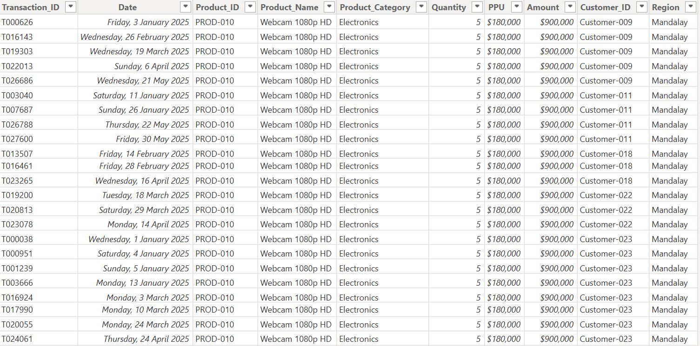
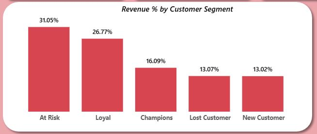
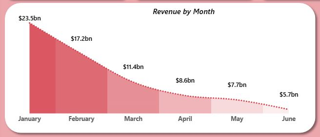
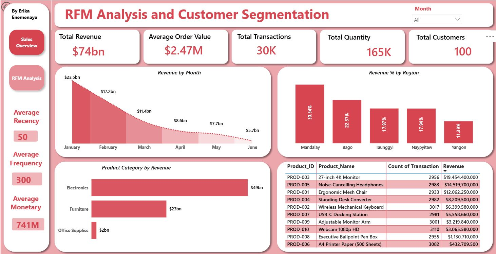
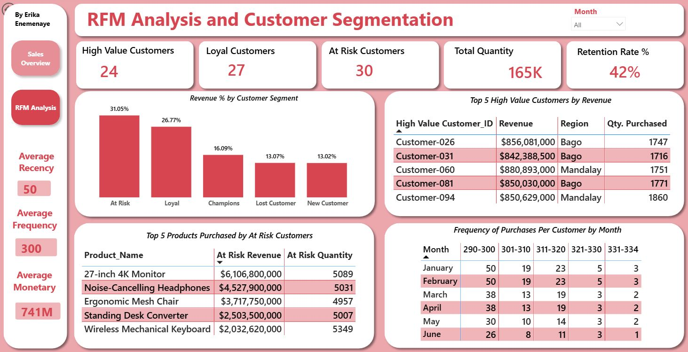

# RFM-Customer-Segmentation

## Project Overview

This project analyzes customer purchasing behaviour for a retail business using RFM (Recency, Frequency, Monetary) analysis.

The analysis segments customers based on their purchasing behaviour, engagement, and overall value to the business. The objective is to identify high-value customers, loyal customers, customers at risk of churning, and other customer segments that can support targeted retention and marketing strategies.

## Business Problem

The business has transaction-level customer data but lacks a clear understanding of which customers are most valuable, which customers are highly engaged, and which customers may be at risk of becoming inactive.

Without proper customer segmentation, marketing and customer retention efforts may not be effectively targeted.

### Key Business Questions

1. Who are the most valuable customers?
2. Which customer segments generate the most revenue?
3. Which customers purchase most frequently?
4. Which customers should the business prioritize for retention?
5. Which customer segment generates the highest revenue from each product category?

## Business Objectives

The main objectives of this analysis are to:

- Identify high-value customers
- Detect loyal customers
- Identify customers at risk of churn
- Improve customer retention strategies
- Support targeted marketing campaigns

## Dataset

### Data Source

The analysis was conducted using a transactional sales dataset containing customer purchase records.

**Source:** Kaggle
[View the dataset on Kaggle]
(https://www.kaggle.com/datasets/charmmyaeaung/raw-sales-dataset-for-rfm-customer-segmentation)

### Dataset Structure

The raw dataset contains approximately **30,000 transaction records**, including:

- 100 unique customers
- 5 regions
- 4 product categories

### Dataset Columns

| Column | Description |
|---|---|
| Transaction_ID | Sales transaction ID |
| Customer_ID | Unique customer identifier |
| Region | Customer region |
| Date | Transaction date |
| Product_ID | Product code |
| Product_Name | Product name |
| Product_Category | Product category |
| Quantity | Units purchased |
| PPU | Price per unit |
| Amount | Transaction total amount |

## Tools & Technologies

- Microsoft Power BI
- Power Query
- DAX
- Microsoft Excel
- Data Modelling
- Data Visualization

## Data Cleaning & Preparation

The dataset was prepared using Excel and Power Query.

The preparation process included:

- Checking for duplicate records
- Checking for missing values
- Correcting data types
- Creating calculated fields
- Preparing customer-level data for RFM analysis
- Validating the dataset before analysis

## Analysis Methodology

The analysis followed an RFM framework:

### Recency

Measures how recently a customer made a purchase.

Customers with more recent purchases receive better recency scores.

### Frequency

Measures how frequently a customer makes purchases.

Customers with more purchases receive better frequency scores.

### Monetary

Measures how much a customer has spent.

Customers who generate higher revenue receive better monetary scores.

### RFM Scoring

Customers were scored based on their Recency, Frequency, and Monetary values and grouped into customer segments.

The resulting segments include:

- Champions
- Loyal Customers
- At-Risk Customers
- Lost Customers
- New Customers

## Key Insights

The analysis identified differences in customer behaviour across the various segments.

### Customer Segmentation

The segmentation helped identify:

- High-value customers who should be prioritized and retained
- Loyal customers who demonstrate consistent purchasing behaviour
- At-risk customers who require retention campaigns
- Lost customers who may require reactivation strategies
- New customers who present an opportunity for further engagement

### Customer Segmentation Table Preview

### Revenue Performance

The analysis also examined revenue contribution across customer segments, regions, and product categories to identify areas of strong and weak performance.

## Recommendations

Based on the analysis, the business should:

1. Prioritize Champions with personalized offers and loyalty rewards.
2. Maintain engagement with Loyal Customers through targeted promotions.
3. Develop retention campaigns for At-Risk Customers.
4. Use reactivation campaigns to win back Lost Customers.
5. Nurture New Customers to encourage repeat purchases.
6. Focus marketing efforts on high-performing product categories.
7. Monitor customer segment movement over time to identify changes in customer behaviour.

## Dashboard

The final interactive dashboard was developed using Power BI.

The dashboard provides insights into:

- Customer segmentation
- Revenue performance
- Customer purchasing behaviour
- Product category performance
- Regional performance
- RFM metrics

### Dashboard Preview

## Project Files

The project includes:

- Power BI dashboard
- Dataset
- Data preparation process
- RFM analysis
- Customer segmentation
- Project documentation

## Conclusion

This project demonstrates how RFM analysis can be used to transform transaction-level data into actionable customer insights.

By identifying customer value and engagement levels, the business can better prioritize retention activities, personalize marketing strategies, and focus resources on customer segments with the greatest business impact.
